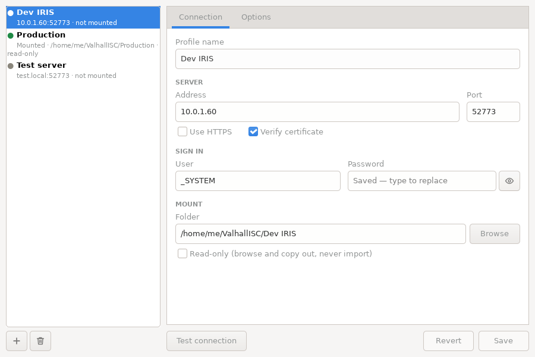

<p align="center"></p>

<h1 align="center">ValhallISC</h1>

<p align="center">Mount the code of an InterSystems IRIS server as a folder on your computer.</p>

ValhallISC exposes IRIS classes, routines, include files and other code documents as ordinary files, organised by namespace and package. Any tool can use them: Finder, Explorer, `cp`, `grep`, `rsync`, `diff`, backup software, CI scripts.

- **Copy out:** every file is the item's **XML export** (byte for byte what `$SYSTEM.OBJ.Export` writes).
- **Copy in:** drop an XML export into a namespace folder and it's **imported and compiled**.
- **Menu bar / system tray app** with profiles for several servers, plus a full **command line** (`--batch`, JSON output) for scripts.
- macOS, Linux and Windows, as a single app or executable per platform.

It builds on the IRIS web API used by VS Code's ObjectScript extension (`/api/atelier/`), so nothing needs to be installed on the server.

<p align="center"></p>

## How it looks

```
~/ValhallISC/Dev IRIS/
├── USER/
│   ├── Demo/
│   │   ├── Person.cls.xml      ← class Demo.Person
│   │   └── Sub/Thing.cls.xml   ← class Demo.Sub.Thing
│   ├── DEMORTN.mac.xml         ← routine
│   └── DemoInc.inc.xml         ← include file
└── TESTNS/ …
```

```sh
cp ~/ValhallISC/Dev\ IRIS/USER/Demo/Person.cls.xml .       # export
cp MyNewClass.xml ~/ValhallISC/Dev\ IRIS/USER/              # import + compile
cp -R ~/ValhallISC/Dev\ IRIS/USER backup/                   # back up a namespace
```

## Requirements

| | Needed |
|---|---|
| IRIS server | 2023.2 or later (Atelier API v7+) with its web server reachable (default port 52773); a user with `%Development` (plus write access to the code database to import) |
| macOS | [FUSE-T](https://www.fuse-t.org) or [macFUSE](https://macfuse.github.io) |
| Windows | [WinFsp](https://winfsp.dev/rel/) |
| Linux | `fuse3`, glibc 2.39 or newer (for the packaged binary), a desktop with a system tray for the GUI |

## Quick start

1. Install the FUSE driver for your system. If it's missing, ValhallISC tells you at startup how to install it on *your* machine: Homebrew or MacPorts on macOS; apt, dnf, pacman, emerge, zypper, apk… by Linux distribution; winget or the download page on Windows.
2. Start ValhallISC (`ValhallISC.app`, `ValhallISC.exe`, or the Linux binary run without arguments).
3. In **Profiles**, click **+**, enter the server, user, password and mount folder, then **Test connection** → **Save**.
4. Click the menu-bar or tray icon, then click the server: its namespaces appear in the mount folder.

The full guide is in **[doc/USAGE.md](doc/USAGE.md)**, and the command line reference in **[doc/CLI.md](doc/CLI.md)**:

```sh
echo "$PW" | valhallisc --batch --create-profile Dev --host iris.local --user _SYSTEM --password-stdin
valhallisc --batch --connect Dev
valhallisc --batch --status
valhallisc --batch --disconnect Dev
```

## Build from source

Requirements: Python 3.12 and a FUSE driver. Docker is needed for the test IRIS and the Linux builds.

```sh
python3.12 -m venv .venv
.venv/bin/pip install -e ".[gui,dev,build]"
.venv/bin/python -m irisfs doctor        # environment check
.venv/bin/python -m irisfs               # tray app
.venv/bin/python -m irisfs --help        # command line
```

Packaging uses PyInstaller:

| Platform | Command | Output |
|---|---|---|
| macOS | `scripts/build-macos.sh` | `dist/ValhallISC.app`, a zip of it, and the `dist/valhallisc` CLI wrapper |
| macOS release | `SIGN_IDENTITY=… NOTARY_PROFILE=… scripts/sign-macos.sh` | signed (hardened runtime), notarized, stapled `dist/ValhallISC-<version>-macos-<arch>.dmg`; see [doc/RELEASING.md](doc/RELEASING.md) |
| Linux | `scripts/build-linux.sh` (in Docker) | `dist/valhallisc-linux-<arch>` |
| Windows | `powershell -ExecutionPolicy Bypass -File scripts\build-windows.ps1` | `dist\ValhallISC.exe`, `dist\valhallisc-cli.exe` |

The Python package is called `irisfs`, after the project's working title. The product name is ValhallISC.

## Tests

A Docker Compose file provides an IRIS Community container with seeded test code (namespaces `USER`, `TESTNS` and `PERFNS`, and a read-only user). A Linux container provides FUSE and Xvfb.

```sh
docker compose -f docker/docker-compose.yml up -d --wait iris
scripts/test.sh all               # lint + mypy, unit, integration, e2e (real mounts), GUI: on this machine
scripts/docker-test.sh all        # the same on Linux in Docker
scripts/test.sh perf              # 2 000-class listing benchmark
```

| Suite | What it covers |
|---|---|
| unit | profiles, secrets, path mapping, VirtualFS logic, Atelier client (mocked HTTP), CLI, controller |
| integration | the Atelier client against real IRIS, with a contract test that keeps the in-memory fake honest |
| e2e | real FUSE mounts driven with `cp`, `cat`, `ls`, `ditto`; mount manager; CLI; outages via a TCP proxy |
| gui | the real wx windows and menus, driven programmatically (Xvfb on Linux) |

The project was built in gated phases. See [doc/PLAN.md](doc/PLAN.md) for the plan, [doc/DECISIONS.md](doc/DECISIONS.md) for the architecture decisions, and `doc/progress/` for the gate reports.

## How it works

```
Tray app / CLI ──► MountManager ──► one worker process per mounted server
                                     └─ FUSE (mfusepy: macFUSE/FUSE-T, libfuse3, WinFsp)
                                          └─ VirtualFS ──► Atelier REST API (/api/atelier/v8) ──► IRIS
```

- **Worker processes:** each mount runs in its own worker, so a crash never takes down the app. Workers record themselves in a small registry, which lets the tray and the CLI see each other's mounts.
- **Reads** are served from XML exports cached per document timestamp. A folder listing prefetches exports in parallel, so file sizes are exact and listings are fast: about 1.3 s cold for 2 000 classes.
- **Writes** are buffered and imported when the file is closed, only if content was written.
- **Copy-engine quirks:** hidden temporary files that tools like Finder and `ditto` write, then rename, are handled.

## Repository layout

```
src/irisfs/        application (atelier/ client, vfs/ filesystem logic, mount/ FUSE + workers, gui/, config/)
tests/             unit, integration, e2e, gui
docker/            IRIS test image + seed code, Linux test/build images
packaging/         PyInstaller spec
scripts/           test, build, icon and screenshot scripts
doc/               usage, CLI reference, plan, decisions, gate reports
assets/            logo and app icons
samples/           an example XML export to try an import
```

## Status and limitations

- **Supported:** export by reading or copying, and import by copying XML exports in.
- **Not supported yet:** deleting, renaming or creating items directly (other than by import), editing UDL source files in place, and CSP/web application files.
- **Windows:** tested from source and with the tray app on Windows (64-bit) with WinFsp. The packaged `.exe` is still being validated.
- **macOS release builds** are signed with the hardened runtime and notarized, using `scripts/sign-macos.sh` with a Developer ID certificate. Local builds are ad-hoc signed.

## License

ValhallISC is free software: you can redistribute it and/or modify it under the terms of the **GNU General Public License v3.0 or later** (see [LICENSE](LICENSE)). The components bundled in the packaged apps and their licenses are listed in [doc/THIRD_PARTY.md](doc/THIRD_PARTY.md).

InterSystems and IRIS are trademarks of InterSystems Corporation. This project is not affiliated with, or endorsed by, InterSystems.
