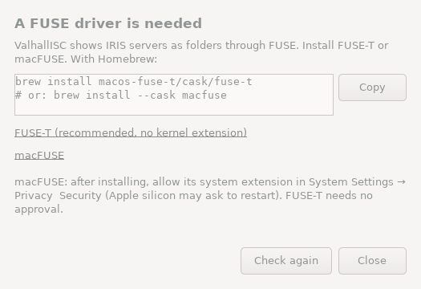

# Using ValhallISC

ValhallISC shows the code of an InterSystems IRIS server (classes, routines, include files and other documents) as ordinary files in a folder on your computer.

- **Copy a file out** of that folder and you get the item's **XML export**.
- **Copy an `.xml` export file in** and it's **imported** (and compiled) on the server.

It runs as an icon in the menu bar (macOS) or the system tray (Windows, Linux), and has a command line for scripts.

## 1. Before you start

**You need a FUSE driver**, the component that lets an app provide a folder:

| System | Install |
|---|---|
| macOS | [FUSE-T](https://www.fuse-t.org) (recommended: no kernel extension, nothing to approve) or [macFUSE](https://macfuse.github.io) (approve its system extension when macOS asks). Both are tested. With FUSE-T, mounted servers appear in Finder under **ValhallISC** in the sidebar's Locations. |
| Windows | [WinFsp](https://winfsp.dev/rel/), e.g. `winget install WinFsp.WinFsp` |
| Linux | the `fuse3` package, e.g. `sudo apt install fuse3` |

**The IRIS server must offer its web API**, `/api/atelier/`, the same one VS Code's ObjectScript extension uses. This needs IRIS 2023.2 or later; the default web port is **52773**. The IRIS user needs the `%Development` resource. Importing also needs write access to the namespace's code database.

**You don't have to look this up.** At startup, and whenever you try to mount, ValhallISC checks for a usable FUSE driver. If there isn't one, it opens a window with instructions for *your* machine, and you can install and then click **Check again**:

| Your system | What the window suggests |
|---|---|
| macOS with Homebrew | `brew install macos-fuse-t/cask/fuse-t` (or `brew install --cask macfuse`) |
| macOS with MacPorts | `sudo port install macfuse` |
| macOS without either | links to the FUSE-T and macFUSE installers |
| Debian, Ubuntu, Mint, Pop!_OS… | `sudo apt install fuse3` |
| Fedora, RHEL, Rocky, AlmaLinux, CentOS… | `sudo dnf install fuse3` |
| Arch, Manjaro, EndeavourOS… | `sudo pacman -S fuse3` |
| Gentoo | `sudo emerge --ask sys-fs/fuse:3` |
| openSUSE / SLES | `sudo zypper install fuse3` |
| Alpine, Void, Solus, NixOS | the matching `apk` / `xbps-install` / `eopkg` command, or the NixOS configuration line |
| Linux with libfuse but no `/dev/fuse` | `sudo modprobe fuse` (and how to load it at boot) |
| Windows | `winget install WinFsp.WinFsp` when winget is available, and the WinFsp download page |

The distribution is recognised from `/etc/os-release`, including derivatives through `ID_LIKE`. Commands can be copied with one click. The same instructions are printed by `valhallisc doctor` and by the command line when a mount needs FUSE.

<p align="center"></p>

Run `valhallisc doctor` to check a machine. It lists the FUSE driver found, the keyring used for passwords, and the settings and log folders.

## 2. Install and start

| System | What you get | How to start it |
|---|---|---|
| macOS | `ValhallISC-<version>-macos-arm64.dmg` (Apple silicon) or `…-macos-x86_64.dmg` (Intel), containing the app, the `valhallisc` command line and the license | Open the DMG and drag **ValhallISC** onto **Applications**. Copy `valhallisc` somewhere in your `PATH` if you want the command line. Release builds are signed and notarized. For a build that isn't notarized: right-click → Open the first time, or run `xattr -dr com.apple.quarantine /Applications/ValhallISC.app`. |
| Windows | `ValhallISC-<version>-windows-x86_64-setup.exe` (installer), or `ValhallISC.exe` (tray app) and `valhallisc-cli.exe` (command line) as single files | Run the installer: no administrator rights needed. It installs for the current user, adds **ValhallISC** to the Start menu, and lists it in *Settings → Apps → Installed apps* to uninstall it. The single files run from anywhere: double-click `ValhallISC.exe`. |
| Linux | `valhallisc-<version>-linux-x86_64` or `…-linux-aarch64` (one file) | Make it executable and run it without arguments for the tray app. It needs glibc 2.39 or newer, `fuse3`, and a desktop with a system tray. On GNOME, enable the *AppIndicator* extension. |

On macOS the app appears in the Dock and its icon in the menu bar. On Windows and Linux the icon is in the system tray. The menu-bar icon is dimmed while nothing is mounted and solid when something is.

Only one copy of the app runs at a time. Opening it again (a click on the Dock icon, the Start menu, Finder, or the executable) shows the **Profiles** window of the copy already running. This is also how to find it when its menu-bar icon is hidden, for example behind the notch of a MacBook. On macOS, Cmd-Q and **Quit** in the Dock ask for confirmation and unmount the servers, like **Quit** in the menu.

## 3. Add a server (profile)

On first start the **Profiles** window opens by itself. Otherwise use **menu → Profiles…**.

1. Click **+** under the list.
2. On the **Connection** tab, fill in:
   - **Profile name:** any name, e.g. "Dev IRIS".
   - **Server:** the host name or IP address, and the port (usually 52773). Tick **Use HTTPS** for TLS.
   - **Sign in:** the IRIS user and password. The eye button shows the password as you type. The password is stored in the system keychain or credential store, never in plain settings files.
   - **Mount → Folder:** where the server should appear. The default is `~/ValhallISC/<profile name>`.
     - *macOS and Linux:* an empty folder. It's created if it doesn't exist.
     - *Windows:* a free drive letter such as `X:`, or a folder that doesn't exist yet (WinFsp creates it).
   - **Read-only:** tick it if this server must only be browsed and copied from, never imported into.
3. **Options** tab (rarely needed):
   - **URL prefix:** set it if IRIS is behind a web gateway with a path, e.g. `/iris`.
   - **Show system items:** also lists `%` classes and library classes.
   - **Compile after import:** on by default.
4. Click **Test connection**. The result appears next to the button: ✓ with the IRIS version and namespaces, or ✗ with the reason.
5. Click **Save**.

Mistakes are shown in red under the field concerned. A mounted profile can't be edited or deleted: its banner offers **Open folder** and **Unmount…** instead.

## 4. Mount and unmount

Click the icon. The menu shows every server with its state:

| Menu entry | Meaning / what a click does |
|---|---|
| `Dev IRIS` | not mounted: **click to mount** |
| `Test server — Connecting…` | in progress (greyed out) |
| `Production — Mounted ▸` | a submenu: where it's mounted, **Open folder**, **Unmount…** (asks for confirmation) |
| `… — Connected from CLI ▸` | mounted with `valhallisc connect`; you can unmount it here too |

On Windows and Linux, a **left click** shows the servers and a **right click** shows **Profiles…** and **Quit**. macOS has a single menu for both.

**Quit** asks for confirmation, then unmounts everything the app mounted. If a folder is still in use, for example open in a Terminal or an editor, you can force the unmount or cancel quitting. Mounts made from the command line stay mounted.

## 5. Working with the files

Once mounted, the folder looks like this:

```
~/ValhallISC/Dev IRIS/
├── USER/                      ← one folder per namespace
│   ├── Demo/                  ← package Demo
│   │   ├── Person.cls.xml     ← class Demo.Person
│   │   └── Sub/Thing.cls.xml  ← class Demo.Sub.Thing
│   ├── DEMORTN.mac.xml        ← routine DEMORTN
│   ├── DemoInc.inc.xml        ← include file DemoInc
│   └── DemoTable.LUT.xml      ← lookup table (other document types too)
└── TESTNS/ …
```

- **Read or copy out:** open a file, or drag or copy it anywhere. You get exactly what `$SYSTEM.OBJ.Export` produces. Folders can be copied whole, e.g. to back up a namespace.
- **Import:** copy or drag an XML export (`*.xml`) into a namespace folder, or save over an existing file.
  - Everything in the file is imported, whatever the file is called.
  - The item is compiled if the profile says so.
  - A notification tells you what was imported, and shows any compile errors. A class with compile errors is still saved, as in Studio or VS Code.
  - A file that isn't an IRIS XML export is refused and nothing changes on the server.
  - Files that are just opened and closed without changes are never re-imported.
- **Refused operations:**
  - other file types (e.g. `notes.txt`);
  - deleting, renaming, or creating folders;
  - anything that writes, when the profile is read-only.

  Files your system creates on its own (`.DS_Store`, `._*`, `desktop.ini`, `Thumbs.db`) are kept in memory only and never reach IRIS.
- **What's listed:** by default only your own code. `%` items, InterSystems library classes, generated classes and CSP files are hidden. Tick **Show system items** in the profile to see the library too. Generated items stay hidden.
- **Loading:** a folder is listed from IRIS when you open it, one level at a time, and cached for a few seconds. Once a folder has been opened it is never waited for again: an expired listing is shown at once and refreshed in the background. Packages mapped from other databases are shown or hidden using the namespace's mappings, read in `%SYS`. Without SQL access to `%SYS` they are checked one by one, which is slower the first time.
- **Read-only files:** classes in deployed mode (no source) and default Studio projects (`Default_<user>.prj`) are listed as read-only, empty files. IRIS has nothing to export for them.
- **Changes made on the server** (e.g. from VS Code) appear within about 10 seconds.

The sample file `samples/Demo.FinderHello.xml` in the project is handy to try an import.

### Source control (git-source-control, CCR, ...)
When a namespace has a source control class, ValhallISC works through it like VS Code does:
- **Copying a file in** calls the source control's save and compile hooks. A document that isn't checked out is refused, and the import fails with IRIS's message ("… is not checked out of source control").
- **Documents you may not change** (not checked out, or checked out by someone else) are shown **read-only**.
- **Checked-out documents** are marked:
  - *macOS:* a Finder tag, green **Checked out** when you checked it out, orange **Checked out by <user>** for someone else;
  - *Linux:* the same text in the `user.xdg.tags` and `user.xdg.comment` attributes, which KDE Dolphin shows;
  - *Windows and Linux:* a read-only `_CHECKED_OUT.txt` in each folder that holds checked-out documents, listing them with who checked them out.

ValhallISC doesn't check out, check in or commit: do that in your usual tool (VS Code, Studio, your source control's web page). The marks follow within a few seconds, when the folder is refreshed.

## 6. Command line

Everything above also works from a terminal or a script:

```sh
echo "$PW" | valhallisc --batch --create-profile Dev --host iris.example.com --user _SYSTEM --password-stdin
valhallisc --batch --test Dev
valhallisc --batch --connect Dev        # mounts in the background and returns
valhallisc --batch --status
valhallisc --batch --disconnect Dev
```

`--batch` prints JSON and uses fixed exit codes. Without it the output is for humans. The full reference is in [CLI.md](CLI.md). On Windows the command is `valhallisc-cli.exe`.

## 7. Troubleshooting

| Problem | What to do |
|---|---|
| "A FUSE driver is needed" window | Run the command it shows (or use its download link), then click **Check again**. macFUSE may need approval in System Settings → Privacy & Security and a restart. |
| "The server rejected the user name or password" | Check user and password with **Test connection**. The user needs `%Development`. |
| "The server could not be reached" | Check host, port, HTTPS and URL prefix. Try `http://host:52773/api/atelier/` in a browser. Check firewalls. |
| "Parent folder … does not exist" / "is not empty" | Choose another mount folder (see section 3 for the Windows rules). |
| "The folder is in use" when unmounting | Close windows, terminals or editors that are inside the folder, or choose **Force unmount**. |
| An import shows "import failed" | The file isn't an IRIS XML export, it's malformed, or the user has no write permission (IRIS error #5883). |
| The macOS volume isn't in the Finder sidebar | Finder → Settings → Sidebar → tick the items under Locations. |
| The tray icon is missing on Linux (GNOME) | Install and enable the AppIndicator extension. |

**Advanced:** extra FUSE mount options can be passed with the `VALHALLISC_FUSE_OPTIONS` environment variable (comma-separated, e.g. `rwsize=65536`).

**Logs:** `valhallisc doctor` prints the log folder. It contains `gui.log` for the app and one `worker-*.log` per mounted server. For more detail, with the duration of every filesystem operation and IRIS request, start the app with the `VALHALLISC_DEBUG=1` environment variable (on macOS: `VALHALLISC_DEBUG=1 /Applications/ValhallISC.app/Contents/MacOS/ValhallISC`), or the command line with `-v`. Operations slower than one second are logged in any case.

## 8. Where things are stored

| What | Where |
|---|---|
| Profiles | `profiles.json` in the settings folder (`valhallisc doctor` shows it; set `VALHALLISC_CONFIG_DIR` to move it) |
| Passwords | macOS Keychain, Windows Credential Manager, or the Linux Secret Service (service name `ValhallISC`). Without a keyring, a private `secrets.json` next to the profiles (mode 0600). |
| Currently mounted servers | the `mounts/` folder in the settings folder, shared by the app and the command line |

To uninstall, quit the app, delete it, and delete the settings and log folders.
